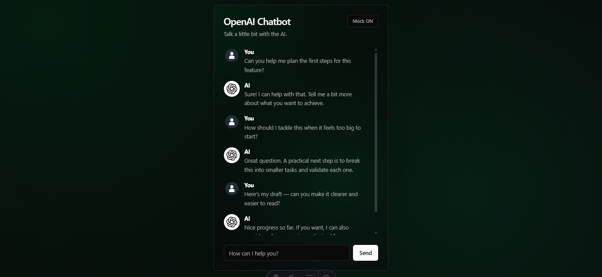

<h1>
  <p align="center">
    
     <br>OpenAI Chatbot 
  </p>
</h1>

<p align="center">
  A web chat app powered by OpenAI, built with Astro, Vue, Tailwind, and Zustand.
  <br /> <br />
    <a href="#environment-variables">Environment Variables</a>
    ·
    <a href="#how-to-run-the-project">How to Run the Project</a>
    ·
    <a href="#openai-models-for-testing">OpenAI Models for Testing</a>
    ·
    <a href="#project-folder-structure">Project Folder Structure</a>
    ·
    <a href="#useful-notes">Useful Notes</a>
</p>

<br/><br/>

## Environment Variables

Create a `.env` file at the project root:

```bash
OPENAI_API_KEY="sk-..."
OPENAI_MODEL="gpt-4o-mini"
```

Notes:

- `OPENAI_API_KEY` is required.
- `OPENAI_MODEL` is optional; if omitted, it falls back to `gpt-3.5-turbo`.

## How to Run the Project

From the repository root:

1. Install dependencies

```bash
npm install
```

2. Start development server

```bash
npm run dev
```

3. Open in your browser

- `http://localhost:4321`

4. Build for production

```bash
npm run build
```

5. Preview the production build locally

```bash
npm run preview
```

## OpenAI Models for Testing

The project reads the model from the `OPENAI_MODEL` environment variable.

- Example models you can test:
  - `gpt-4o-mini`
  - `gpt-4.1-mini`
  - `gpt-4.1`
  - `gpt-3.5-turbo`

If `OPENAI_MODEL` is missing or empty, the system uses:

- **default:** `gpt-3.5-turbo`

## Project Folder Structure

```text
openai-chatbot/
├── public/
│   └── favicon.svg
├── src/
│   ├── actions/
│   │   └── index.ts              # server-side action that calls OpenAI
│   ├── components/
│   │   └── chat/
│   │       └── Chat.vue          # main chat UI
│   ├── layouts/
│   │   └── BaseLayout.astro      # base layout + metadata tags
│   ├── pages/
│   │   └── index.astro           # home page
│   ├── schemas/
│   │   └── message.ts            # shared schemas and types
│   ├── store/
│   │   ├── chatStore.ts          # Zustand store (state + submit flow)
│   │   ├── chatStore.helpers.ts  # store helpers
│   │   ├── chatStore.types.ts    # store types
│   │   ├── useChatStore.ts       # Vue reactivity bridge
│   │   └── index.ts              # store layer exports
│   └── styles/
│       ├── globals.css
│       ├── chat.css
│       └── animations.css
├── .env
├── package.json
└── README.md
```

## Useful Notes

- There is a **Mock ON/OFF** toggle in the chat header to enable sequential mock responses.
- Real mode uses the action in `src/actions/index.ts` to call OpenAI.


